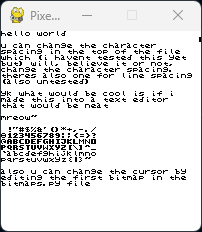

hi

hru

im okay

i made this weird thing in python cuz i was inspired to bc i made a cool bitmap drawer thing on my ti-84 that used matrixes and yeah it was rlly cool :3

anyways run `keyboardthing.py` which just echos back what you type

if i knew assembly this would be so much cooler but idk how why where when dalfasdkhjfasld

okay bye

i might mess w/ this later but ill just leave it here how it is for now :P

